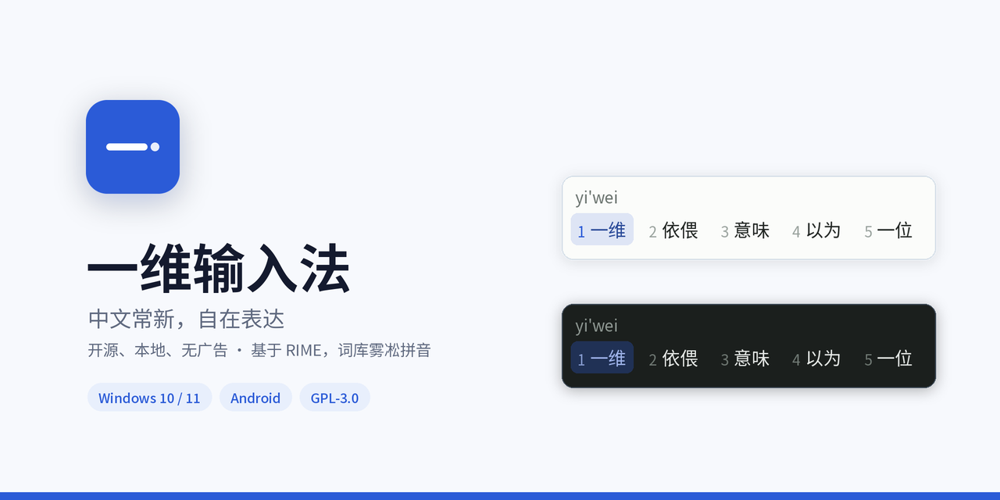
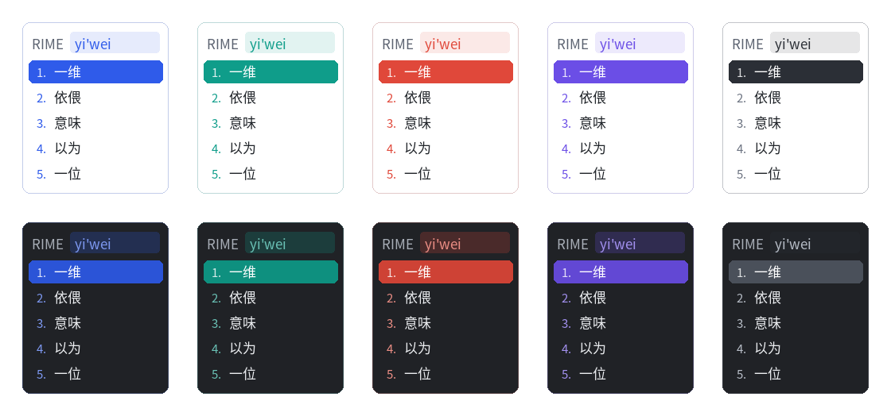

<div align="center">



**中文常新，自在表达。** 开源、本地、无广告的 Windows 与 Android 输入法，基于 RIME。

[](https://github.com/yiweishurufa/yiwei-ime/releases/tag/nightly)
[](https://github.com/yiweishurufa/yiwei-ime/releases/tag/android-nightly)

[](https://github.com/yiweishurufa/yiwei-ime/actions)
[](LICENSE)


[下载](#-下载) · [功能](#-功能) · [皮肤](#-五色皮肤) · [隐私](#-隐私) · [常见问题](#-常见问题) · [构建](#-构建)

</div>

---

## ✨ 为什么选一维

- **不打扰**：没有广告、弹窗、资讯推送，不强制登录。
- **数据在你手里**：组字、词频、常用语、统计全在本机；同步走你自己的网盘。
- **AI 按需用**：只有按下快捷键时，才把选中的那段文字发给你自己配置的接口。
- **开箱即用**：默认雾凇拼音，词库每天自动更新；新版本一键静默升级。

## 📥 下载

1. 打开 [最新版本页面](https://github.com/yiweishurufa/yiwei-ime/releases/tag/nightly)，下载 `yiwei-ime-*-installer.exe`。
2. 双击安装，在系统输入法列表里选「一维输入法」即可开打。
3. 以后有新版本，托盘会提示，点一下即可静默升级，设置和词库都会保留。

> 可以和小狼毫同时安装，互不干扰。支持 Windows 10 / 11。

**Android**：打开 [安卓测试版页面](https://github.com/yiweishurufa/yiwei-ime/releases/tag/android-nightly)，大多数手机下载 `arm64-v8a` 版本。安装后在系统设置 → 语言和输入法里启用「一维输入法」，第一次打开会部署词库，需要一两分钟。支持 26 键与九键，十一套皮肤跟随系统深色模式。

## 🧩 功能

| | 功能 | 怎么用 |
|---|---|---|
| ⌨️ | **雾凇拼音** | 全拼与各家双拼；`rq` 日期、`sj` 时间、`V` 计算器、农历、大写金额、Unicode、拆字、以词定字 |
| 📚 | **词库每天更新** | 自动拉取雾凇新词库，SHA-256 校验、自动备份，出问题一键回滚 |
| 🧠 | **语法模型** | 可选下载万象语法模型，长句更准，支持断点续传 |
| 📋 | **常用语一键上屏** | 长按 **Alt** + **1–9** 打开面板，手机号、邮箱、地址按一个键输入 |
| 🌐 | **翻译和润色** | 选中文字，长按 **Alt** + **空格**：翻译、润色、粤语，可自定义；支持 OpenAI、DeepSeek、通义千问、Kimi、智谱、本机 Ollama |
| 🔀 | **按应用切中英** | 游戏、微信默认中文，终端、编辑器默认英文；内置约 75 个常见程序，可扫描本机应用并手动调整 |
| 🗣️ | **模糊音** | 11 组常见规则，按需勾选（z/zh、n/l、in/ing…） |
| 🈳 | **生僻字** | 一键开启 4 万字大字表，自动补齐候选字体 |
| ☁️ | **网盘同步** | OneDrive、坚果云、百度同步盘、Dropbox、Syncthing、iCloud 或任意目录 |
| 🔤 | **简繁转换** | 本机 OpenCC，无需联网 |
| 📊 | **年度输入统计** | 字数、时段、常用应用；只存本机，默认关闭 |
| 🚚 | **从小狼毫搬家** | 「设置 → 导入」一键复制方案、补丁和词库 |

## 🎨 五色皮肤

墨蓝 · 青碧（默认）· 朱砂 · 靛紫 · 石墨，每色都有深色版本，跟随系统自动切换；托盘「中/英」图标同步变色。

<div align="center"></div>

另有石墨、午夜、樱花、抹茶、北境、纸墨等配色，支持横排、竖排，设置页边改边看。

## 🔒 隐私

| | 一维 | 常见商业输入法 |
|---|:---:|:---:|
| 遥测与行为上报 | ❌ 无 | 默认开启 |
| 云联想 / 云输入 | ❌ 不上传 | 默认开启 |
| 广告与资讯弹窗 | ❌ 无 | 常见 |
| 强制登录 | ❌ 不需要 | 部分功能需要 |
| 同步 | 你自己的网盘 | 厂商云端 |
| 源代码 | ✅ 完全开源 | 闭源 |

联网只发生在三种情况：检查词库更新、检查新版本（只访问 GitHub），以及你主动使用 AI 功能时。全部可在设置中关闭。详见 [竞品调研](docs/competitor-research.md)。

## ❓ 常见问题

<details>
<summary><b>和小狼毫是什么关系？</b></summary>

一维基于小狼毫源码构建，但改用了独立的系统标识、安装目录和用户目录，两者可以共存。也可以在「设置 → 导入」把小狼毫的配置搬过来。
</details>

<details>
<summary><b>在国内下载慢怎么办？</b></summary>

安装包和词库都托管在 GitHub。若下载失败，稍后重试或使用你习惯的加速方式；更新清单另有 jsDelivr 备用源。
</details>

<details>
<summary><b>AI 功能要花钱吗？</b></summary>

一维本身不收费，也不内置任何 AI 服务。你填入自己的接口和密钥（或使用本机 Ollama），费用由你选择的服务商决定。
</details>

<details>
<summary><b>旧版本能自动升级吗？</b></summary>

0.1.0.16 起支持自动升级。更早的版本需要手动安装一次新版，之后就会自动提示。
</details>

## 🛠️ 构建

GitHub Actions 全自动构建（[`build.yml`](.github/workflows/build.yml)）：

```
小狼毫源码（固定版本）
  → scripts/rebrand.py        改名，替换 TSF CLSID、注册表、管道、目录
  → scripts/customize_data.py 装入雾凇拼音、配色与扩展
  → helper/                   一维助手（.NET Framework 4.8）
  → NSIS 打包 → Releases
```

## 🙏 开源与致谢

一维输入法是 [AIME 艾么输入法](https://aime.zool.app/)（macOS）的 Windows 版复刻，站在这些项目的肩膀上：

| 项目 | 协议 |
|---|---|
| [小狼毫 Weasel](https://github.com/rime/weasel) | GPL-3.0 |
| [librime](https://github.com/rime/librime) | BSD-3-Clause |
| [雾凇拼音 rime-ice](https://github.com/iDvel/rime-ice) | GPL-3.0 |
| [OpenCC](https://github.com/BYVoid/OpenCC) | Apache-2.0 |
| AIME 艾么输入法 | MIT，© 2026 ZOOL LLC |

一维输入法整体以 **GPL-3.0** 发布，见 [LICENSE](LICENSE)。

<div align="center"><sub>如果一维帮到了你，点个 ⭐ 让更多人看到。</sub></div>
